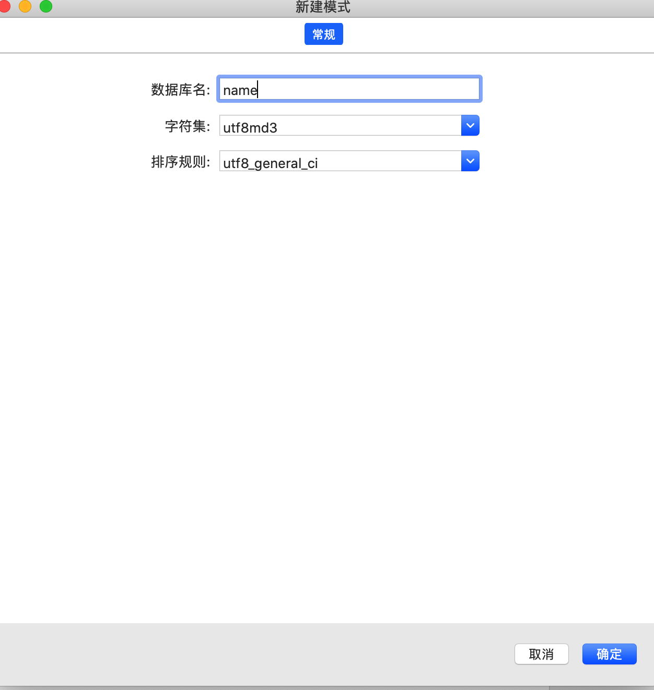
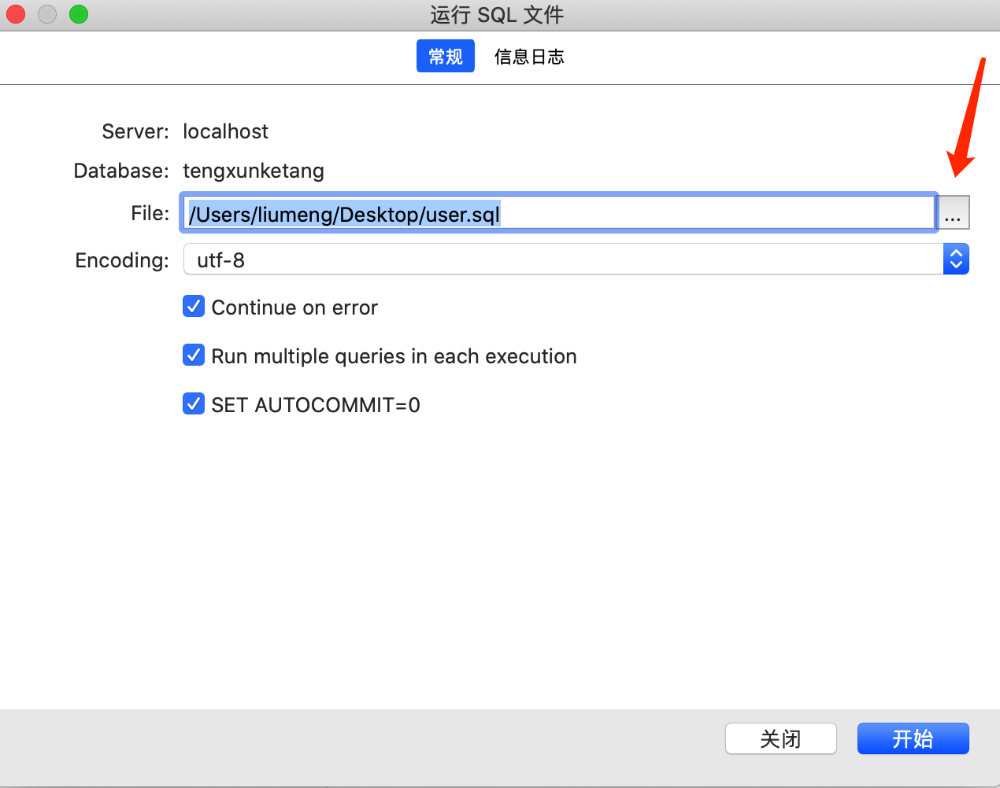

# 数据库操作

## 添加数据库

1. 新建数据库：打开 Navicat 新建数据库, 右击 localhost 连接，新建数据库

2. 导入数据：右击新建的数据库，选择 “运行 SQL 文件” 点击下图红色箭头文件，选择本地的数据库文件进行导入

项目接入数据库配置
1. 安装插件：在项目中安装对应的插件 egg-mysql
> (egg-mysql [文档地址](https://www.npmjs.com/package/egg-mysql))
``` bash
npm install egg-mysql -S
```
2. 开启插件：在 config/plugins.js配置中开启插件
```js
exports.mysql = {
  enable: true,
  package: 'egg-mysql',
};
```
3. 创建配置文件：在 config 下创建 db.js 存放个人数据库连接信息
```js
/* mysql */
const MYSQL_HOST ="localhsot" // host地址 没有进行地址映射默认为127.0.0.1 
const MYSQL_PORT = "3306" // 默认3306
const MYSQL_USER = "root" // 数据库用户名
const MYSQL_PWD = "xx" // 数据库密码
const MYSQL_DB = "xx" // 数据库名

module.exports = {
  MYSQL_HOST,
  MYSQL_PORT,
  MYSQL_USER,
  MYSQL_PWD,
  MYSQL_DB
}
```
4. 连接数据库：在 config/config.default.js 中导入 db.js 进行数据库连接
```js
const { MYSQL_DB, MYSQL_PWD, MYSQL_USER, MYSQL_PORT, MYSQL_HOST } = require('./db');

config.mysql = {
    client: {
      host: MYSQL_HOST,
      port: MYSQL_PORT,
      user: MYSQL_USER,
      password: MYSQL_PWD,
      database: MYSQL_DB,
    },
    app: true,
    agent: false,
  };
```

##  数据查询测试

1. 查询数据库：在 app/controller/user.js 中使用 SQL 语句查询数据库
```js
'use strict'

const Controller = require('egg').Controller

class UserController extends Controller {
  async index() {
    const { ctx，app} = this
    const user = await app.mysql.select('user') // user 是数据库中的表名
     ctx.body = user
  }

module.exports = UserController
```
2. 接口测试：在地址栏中输入 http://127.0.0.1/user/login 进行接口测试, 能够正常看到数据库 user表的所有内容就表示测试通过