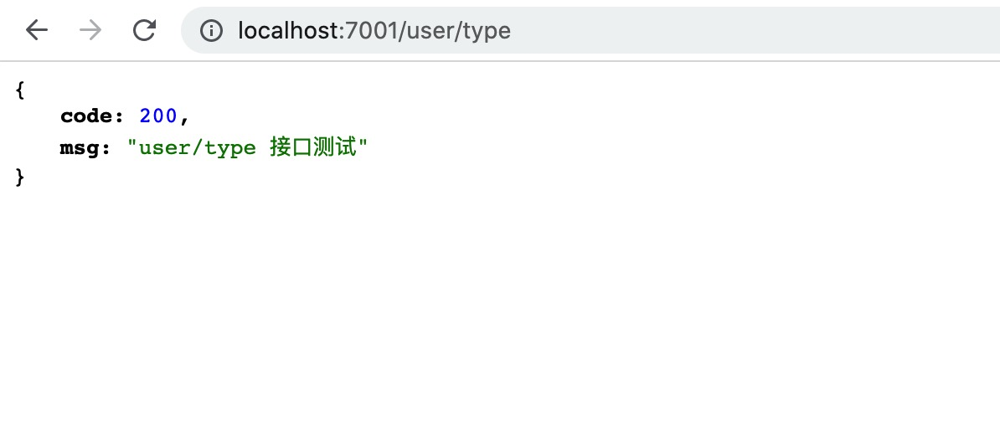

# 项目进阶

## 添加新接口

1. 添加接口文件：在 app/controller 下添加 user.js

```js
'use strict'
const Controller = require('egg').Controller

class UserController extends Controller {
  async type() {
    const { ctx } = this
      ctx.body = { code: 200, msg: 'user/type 接口测试' }
  }

module.exports = UserController
```

2. 添加接口配置：在 app/router 中配置 user/type 端口

```js
router.get('/user/type', controller.user.type)
```

3. 接口测试：在地址栏输入接口地址进行测试 (http://127.0.0.1/user/type)
   

## 连接数据库

1. 安装模块：在项目中安装对应的模块 egg-mysql
   > (egg-mysql [文档地址](https://www.npmjs.com/package/egg-mysql))

```bash
npm install egg-mysql -S
```

2. 开启模块：在 config/plugins.js 配置中开启模块

```js
exports.mysql = {
  enable: true,
  package: 'egg-mysql'
}
```

3. 创建配置文件：在 config 下创建 db.js 存放个人数据库连接信息

```js
/* mysql */
const MYSQL_HOST = 'localhost' // host地址 没有进行地址映射默认为127.0.0.1
const MYSQL_PORT = '3306' // 默认3306
const MYSQL_USER = 'root' // 数据库用户名
const MYSQL_PWD = 'xx' // 数据库密码
const MYSQL_DB = 'xx' // 数据库名

module.exports = {
  MYSQL_HOST,
  MYSQL_PORT,
  MYSQL_USER,
  MYSQL_PWD,
  MYSQL_DB
}
```

4. 连接数据库：在 config/config.default.js 中导入 db.js 进行数据库连接

```js
const {
  MYSQL_DB,
  MYSQL_PWD,
  MYSQL_USER,
  MYSQL_PORT,
  MYSQL_HOST
} = require('./db')

config.mysql = {
  client: {
    host: MYSQL_HOST,
    port: MYSQL_PORT,
    user: MYSQL_USER,
    password: MYSQL_PWD,
    database: MYSQL_DB
  },
  app: true,
  agent: false
}
```

## 数据查询测试

1. 查询数据库：在 app/controller/user.js 中使用 SQL 语句查询数据库

```js
'use strict'

const Controller = require('egg').Controller

class UserController extends Controller {
  async type() {
    const { ctx，app} = this
    const user = await app.mysql.select('user') // user 是数据库中的表名
     ctx.body = user
  }
}

module.exports = UserController
```

2. 接口测试：在地址栏中输入 http://127.0.0.1/user/type 进行接口测试, 能够正常看到数据库 user 表的所有内容就表示测试通过

## 模版处理

### 更新请求接口

1. 修改请求 url ：修改 src/api/user 中 login 的 url

```js
export function login(data) {
  return request({
    url: '/user/login',
    method: 'post',
    data
  })
}
```

2. 修改请求端口：修改 src/utils/request.js 中的请求地址

> 服务端接口现阶段只配置了 'user/login' 其他接口暂时还没有添加，所以这里只针对 'user/login' 进行了处理，为了不影响整个项目的运行，后面对 '/user/info' 也进行了相同的操作 即 'user/login' 和 '/user/info' 访问的是本地服务端接口，其他接口还是正常使用模版项目中的接口，

```js
service.interceptors.request.use(
  config => {
    if (config.url === '/user/login' || config.url === '/user/info') {
      config.baseURL = 'http://localhost:7001/'
    }
    if (store.getters.token) {
      config.headers['X-Token'] = getToken()
    }
    return config
  },
  error => {
    console.log(error) // for debug
    return Promise.reject(error)
  }
)
```

3. 响应结果处理：对接口中返回的响应信息进行处理

> 我将响应信息错误信息中的的 message 该成了 msg,这里的 code 也可以根据你的需要进行修改，当然你也可以选择不对响应信息进行处理，相对应的服务端返回的信息就要和这里的变量保持一致。即 code 需要等于 20000 ，返回的自定义信息需要为 message。 下面的响应逻辑你也可以根据自己需要进行修改

```js
service.interceptors.response.use(
  response => {
    const res = response.data
    if (res.code !== 20000) {
      Message({
        message: res.msg || 'Error',
        type: 'error',
        duration: 5 * 1000
      })
      ...
      return Promise.reject(new Error(res.msg || 'Error'))
    } else {
      return res
    }
  },
  error => {
    console.log('err' + error) // for debug
    Message({
      message: error.msg,
      type: 'error',
      duration: 5 * 1000
    })
    return Promise.reject(error)
  }
)
```

4.  清空默认内容：清空模版项目中登录组件默认指定的用户名和密码

```js
data() {
  return{
    loginForm: {
        username: '',
        password: ''
      },
  }
}
```

5.  校验规则修改：修改模版项目中登录组件的用户名校验规则, 校验规则文件：src/utils/validate.js

> 模版文件中用户名使用的是自定义校验指定了必须为 'admin' 或 'editor', 你可以根据需要在这里添加自定义规则。我这里为了方便测试就简单的添加了可以通过的用户名。

```js
export function validUsername(str) {
  const valid_map = ['testuser', 'admin', 'editor']
  return valid_map.indexOf(str.trim()) >= 0
}
```

6.  登录页面修改：删除登录页面中登录按钮下方的提示类信息,让登录页面更加整洁
    > 这里的内容可以根据自己的需要进行使用。

```js
<div style="position:relative">
  <div class="tips">
    <span>Username : admin</span>
    <span>Password : any</span>
  </div>
  <div class="tips">
    <span style="margin-right:18px;">Username : editor</span>
    <span>Password : any</span>
  </div>
  <el-button class="thirdparty-button" type="primary" @click="showDialog=true">
  Or connect with
  </el-button>
</div>
```
