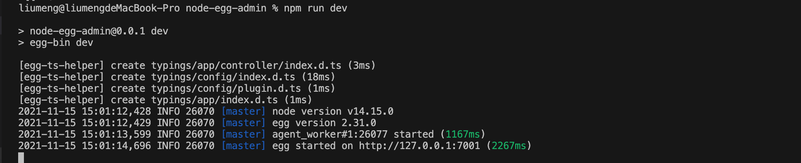
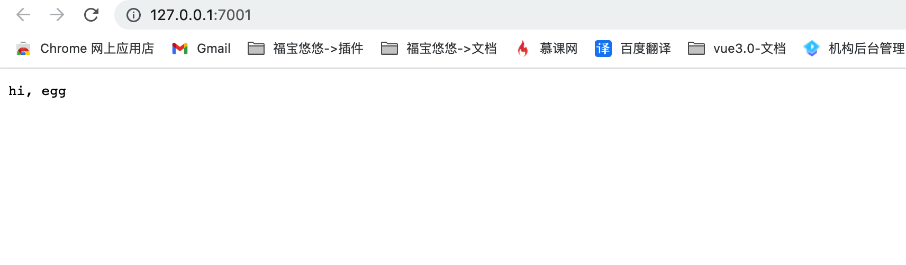

# 项目初始化
1. 新建项目文件:  在本地创建 node-egg-admin文件夹
```bash
mkdir node-egg-admin
```
2.  生成项目：进入文件夹在控制台输入如下命令生成服务端项目

```bash
npm init egg --type=simple
```
3.  安装依赖：安装项目中使用的依赖
```bash
npm install 或 cnpm install 或者 yarn add
```
4. 启动项目：查看 package.json 中的启动命令，通过 npm run dev 或者 yarn dev 执行启动命令启动服务端项目
```js
"scripts": {
    "start": "egg-scripts start --daemon --title=egg-server-node-egg-admin",
    "stop": "egg-scripts stop --title=egg-server-node-egg-admin",
    "dev": "egg-bin dev",
    "debug": "egg-bin debug",
    "test": "npm run lint -- --fix && npm run test-local",
    "test-local": "egg-bin test",
    "cov": "egg-bin cov",
    "lint": "eslint .",
    "ci": "npm run lint && npm run cov",
    "autod": "autod"
  }
```
5. 接口访问测试: 项目启动后看到如下图所示，表示项目已经启动可以点击下面的链接进行访问
