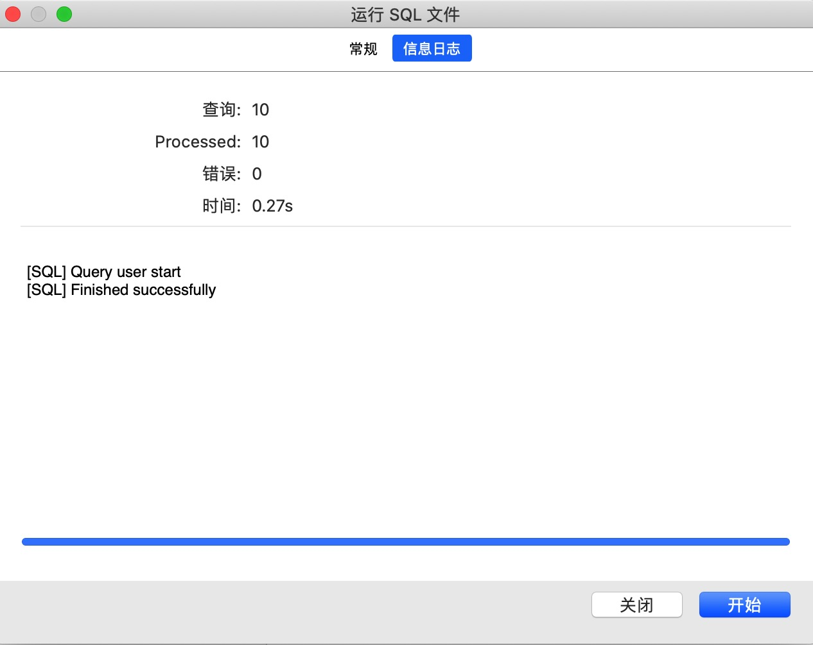

# 数据库初始化

## 下载插件

### mysql

> MySQL 是关系型数据库，其开放式的架构使得用户的选择性很强，而且随着技术的逐渐成熟，MySQL 支持的功能也越来越多，性能也在不断地提高，对平台的支持也在增多，此外，社区的开发与维护人数也很多。当下，MySQL 因为其功能稳定、性能卓越，且在遵守 GPL 协议的前提下，可以免费使用与修改，因此深受用户喜爱

- [下载地址：](https://dev.mysql.com/downloads/mysql/) https://dev.mysql.com/downloads/mysql/

### Navicat

> Navicat Premium 是一套数据库开发工具，让你从单一应用程序中同时连接 MySQL、MariaDB、MongoDB、SQL Server、Oracle、PostgreSQL 和 SQLite 数据库。它与 Amazon RDS、Amazon Aurora、Amazon Redshift、Microsoft Azure、Oracle Cloud、MongoDB Atlas、阿里云、腾讯云和华为云等云数据库兼容。你可以快速轻松地创建、管理和维护数据库。

- [下载地址：](https://www.navicat.com.cn/products/navicat-premium) https://www.navicat.com.cn/products/navicat-premium

## 导入数据
> [数据库文件地址](https://fast-learn.youbaobao.xyz/user.sql) 
1. 新建数据库：打开 Navicat 新建数据库, 右击 localhost 连接，新建数据库
   
2. 运行文件：右击新建的数据库，选择 “运行 SQL 文件” 点击下图红色箭头文件，选择本地的数据库文件进行导入
   
3. 导入数据：点击开始按钮即可导入数据
   
