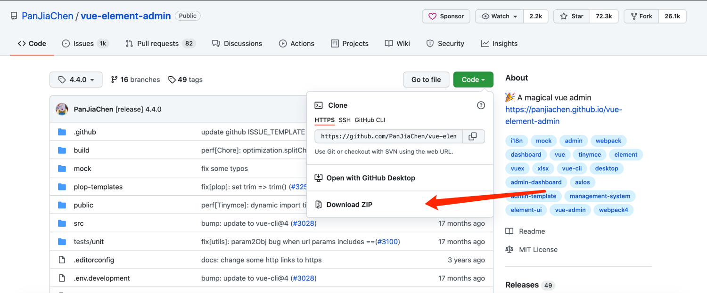
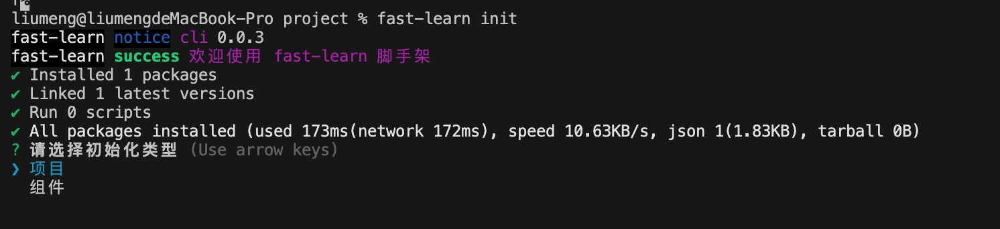
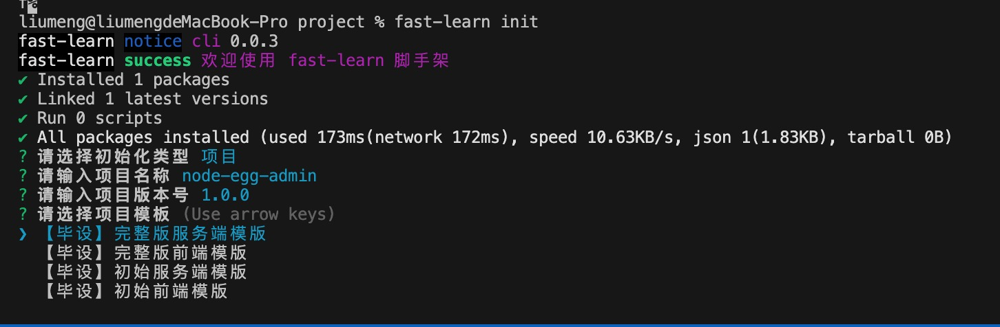

# 前端项目初始化

## 常规模式

1. 下载模版项目：点击文档中的链接下载模版文件代码
   > [模版文件代码](https://github.com/PanJiaChen/vue-element-admin/tree/4.4.0)
   > 
2. 安装依赖：解压项目源码，进入项目，打开控制台安装项目依赖包

```bash
npm install 或 cnpm install 或者 yarn add
```

3. 启动模版项目：依赖安装完成后根据 package.json 中 scripts 的命令启动项目

```bash
npm run dev
```

4. 常见问题：项目启动过程中如果遇到 core-js 的报错，可以在项目中安装最新版本的 core-js

```bash
npm install core-js@3.19.1
```

## 简单模式

1. 全局安装脚手架

```bash
npm install fast-learn -g
```

2. 使用方式

```bash
fast-learn init
```

## fast-laern 使用流程

1. 创建项目：创建存放项目模版的文件夹

```bash
mkdir project
```

2. 执行安装命令：执行脚手架命令安装模版

```bash
fast-leran init
```

3. 选择模版类型：选择安装模版的类型为组件
   > fast-learn 是为课程搭建的脚手架命令，组件模版暂时还没有进行更新，等课程更新时会对应更新组件模版
   > 
4. 输入项目描述：根据提示输入项目名称和版本号
   
5. 选择安装的项目模版：根据自己的需求下载对应的项目模版，这里我们选择【毕设】初始前端模版进行开发
   
6. 启动项目：选择项目安装模版后，fast-leaen 会自动帮我们安装依赖并启动项目

### 模版介绍

- 【毕设】完整版前端模版：是课程完成的前端源码，里面课程的代码已经开发完成，启动之后效果就和演示效果一致
- 【毕设】初始前端模版：基础版的前端端源码，这是一个模版项目删除了课程中的操作，下载后可以直接启动进行开发使用。
- 【毕设】完整版服务端模版：是课程最终的服务端源码，需要添加连接数据库的信息和 https 服务就可以启动
- 【毕设】初始服务端模版：基础版的服务端源码，下载后可以直接启动进行开发
