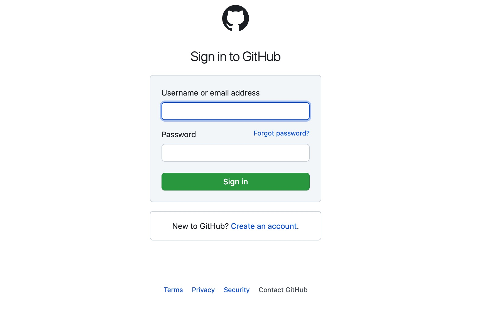
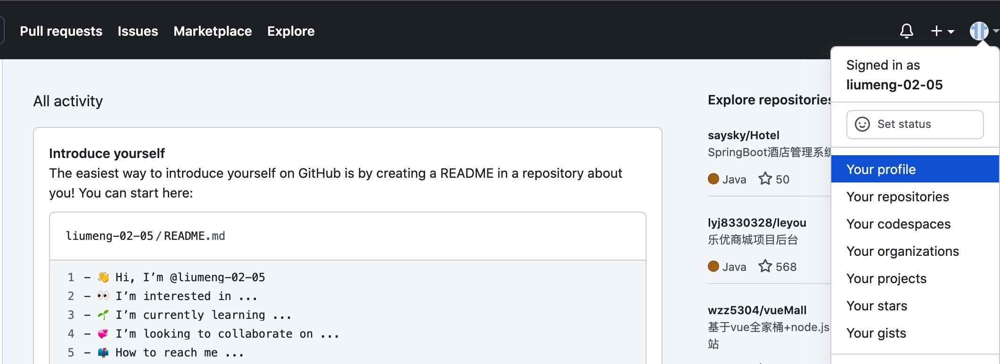
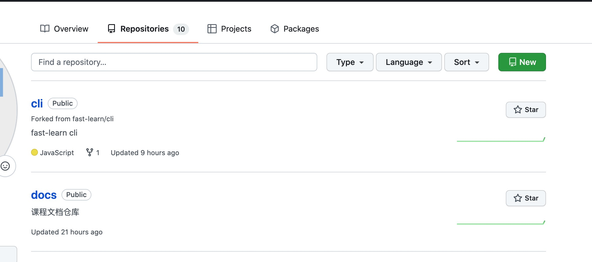
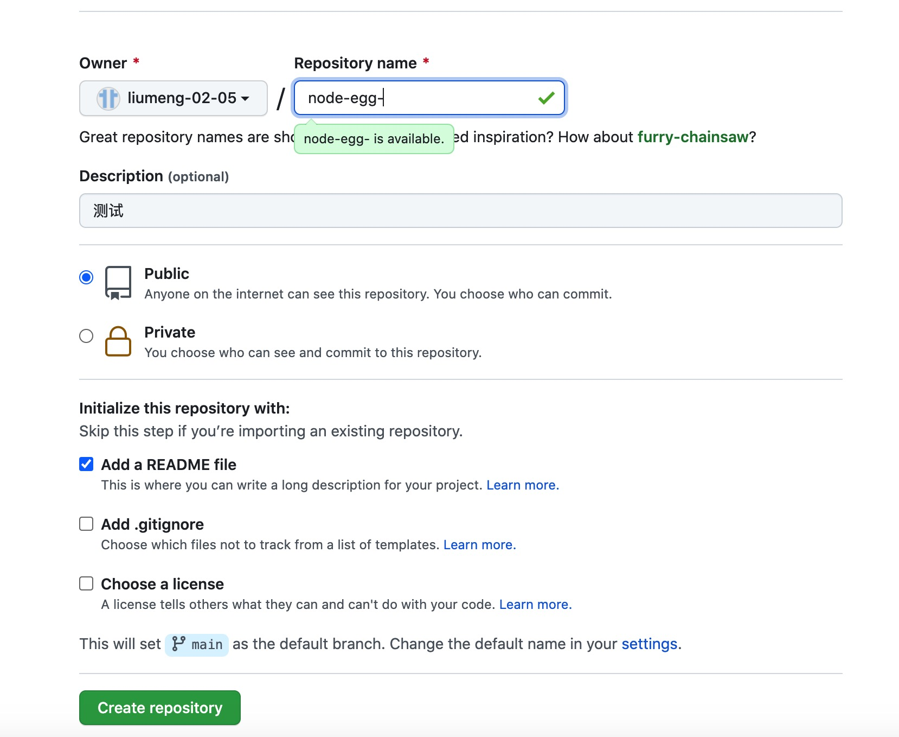
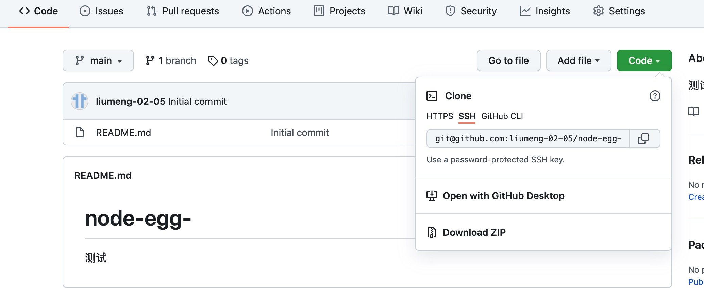
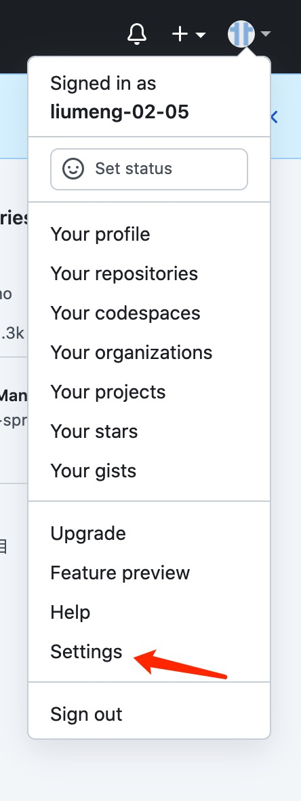
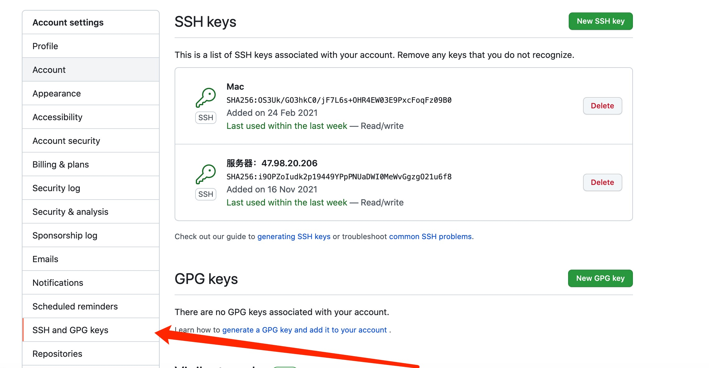
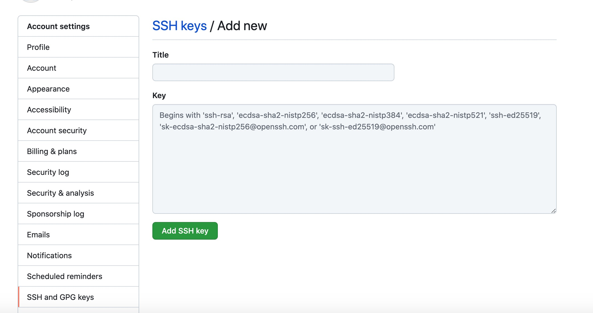

# 发布准备

##  服务端准备
### 创建仓库

1. 进入 github 官网：[官网地址](https://github.com/)
> 如果 github 没有账号，可以点击右上角的 Sign up 进行注册,如果有可以点击 Sign in 进行登录
   
2. 点击右侧用户按钮进入主页
   
3. 点击 Repositories,选择右侧的 new 创建仓库

4. 输入仓库信息，创建仓库

5. 点击 code 选择 SSH 密钥地址
> 如果没有配置 SSH 密钥 可以先进行配置在进行使用



### SSH 密钥配置
1. 检测本地是否有SSH
```bash
cd ~/.ssh
ls
```
2. 执行生成 SSH 密钥命令，一直按回车
```bash
ssh-keygen -t rsa -C "邮箱地址"
```
3. 命令执行完毕后会在本地生成两个文件 id_rsa.pub 和 id_rsa
4. 打开 ssh/id_rsa.pub 复制里面的内容
```bash
vim ~/.ssh/id_rsa.pub
```
5. 进入 github，点击头像，选择 settings

6. 点击右侧的 SSH and GPG keys 选项,点击右侧的 New SSH key 添加key

7. 输入标题，把复制的内容添加到key，点击 Add SSH key就可以看到最新生成的 key 了


### 上传代码
1. 进入项目，打开控制台使用 git 命令初始化本地项目
```bash
git init
```
2. 添加远程仓库的源，和本地项目进行链接
```bash
git  remote add origin git@github.com:xx/xx.git
```
3. 拉取远程仓库代码
```bash
git pull origin master –allow-unrelated-histories
```
4. 添加本地代码到缓存区，可以查看提交的文件状态
```bash
git add .
git status
```
5. 提交本地代码
```bash
git commit -m '提交信息'
```
6. 推送代码到 github 仓库
```
git push origin master
```

## 前端打包项目
1. 修改配置文件：修改 vue.config.js 中的 publicPath
```js
publicPath: './',
```
2. 打包项目：执行打包命令打包项目文件
```bash
npm run build:prod
```
## 服务器
- SSL
- ECS
- 域名
