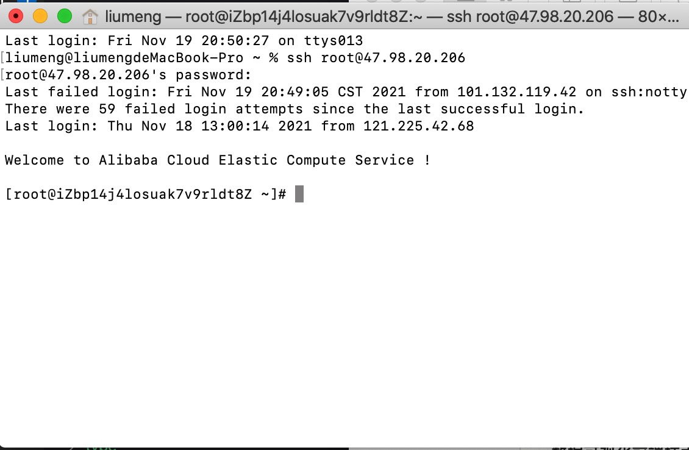
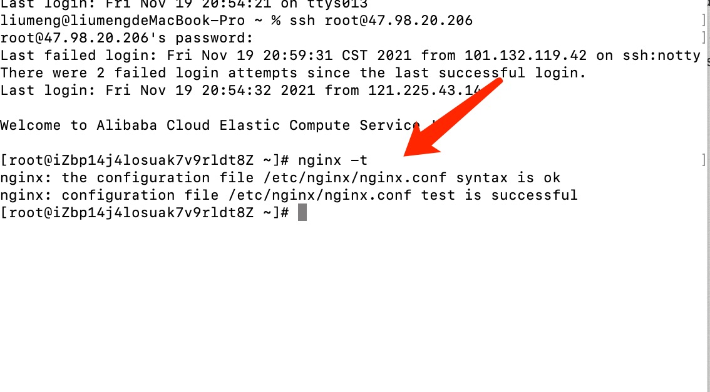

# 完善阶段

## 进入 ECS 服务器
1. 输入登录指令
```bash
ssh root@47.98.20.206
```
2. 输入密码，看到如下欢迎界面表示登录成功


## 服务端代码配置
> 课程中购买使用的的 ECS 是配置了 node 服务的，所以里面的 nginx node git 这些命令都是可以直接使用的，如果没有配置node 服务需要自己安装这些命令。
1. 生成 SSH 密钥添加到 github 仓库
> SSH 密钥的添加可以查看上一节内容
2. 创建项目
```bash
mkdir mode-egg-admin
```
3. 下载服务端项目源码
```bash
git clone git@github.com:xx/xx.git
```
4. 进入项目安装项目依赖包
```bash
npm install
```
5. 启动项目
> 如果直接克隆的是课程的成品源码文件，直接启动是启动不了的，源码文件中删除了 https 证书和 db.js,需要根据自己的数据库和证书内容进行添加 
```bash
npm run dev
```
## nginx 配置
1. 在服务器上创建nginx配置文件
> 这个配置文件可以随意命名，但是需要是 .conf 文件
```bash
mkdir nginx
touch upload.conf
```
1. 查找nginx命令的实际执行文件
> 课程中的 nginx 是 ECS 中配置好了的，可以通过 nginx -t 找到 nginx 的配置文件 nginx.conf

2. 进入nginx 配置文件
```bash
cd /etc/nginx
```
3. 打开 nginx.conf 配置文件, 点击 i 键进入编辑状态，修改 user,使用 include 指向本地 nginx 配置文件 upload.conf
> ECS 这里默认使用 include 配置一个文件，指向 /etc/nginx/conf.d/default.conf，它占用了 80 端口并将其重定向到 3000端口，在使用时可以在 nginx.conf 中删除或或者该 include 指向代码。
```
vim nginx.conf

// nginx
user root;
...
include upload.conf的文件位置
```
4. 配置完成后按 esc 输入 :wq 退出配置文件
5. 进入 upload.conf 文件夹下,打开 upload.conf 配置 http 端口
```bash
server
{ 
  charset utf-8;
  listen 80;
  server_name http_host;
  root /root/nginx;
  autoindex off;
  add_header Cache-Control "no-cache, must-revalidate";
  location / { 
    add_header Access-Control-Allow-Origin *;
  }
}
```
5. 配置 https
> 配置 https 服务需要有 SSL 证书，如果没有可以单独配置 http 服务. error_log\access_log 存放日志文件的文件夹
```bash
server
{
  listen 443 default ssl;
  server_name https_host;
  root /root/nginx;
  autoindex off;
  add_header Cache-Control "no-cache, must-revalidate";
  location / {
    add_header Access-Control-Allow-Origin *;
  }
  ssl_certificate /xx.pem;
  ssl_certificate_key /xx.key;
  ssl_session_timeout  5m;
  ssl_protocols  SSLv3 TLSv2;
  ssl_ciphers  ALL:!ADH:!EXPORT56:RC4+RSA:+HIGH:+MEDIUM:+LOW:+SSLv2:+EXP;
  ssl_prefer_server_ciphers  on;
  error_log /root/xx.log error;
  access_log  /root/xx.log;
}
```
6. 退出配置文件，检查 nginx 语法问题
```bash
nginx -t 
```
7. 重启 nginx 服务
```bash
nginx -s reload
```

## 前端代码上传

## FileZilla 使用方式
> 向服务器上上传文件可以通过 FileZilla实现。 [FileZilla 下载地址:](https://filezilla-project.org/)
1. 打开 FileZilla 软件后，点击左上方的连接按钮

2. 这里会显示你连接的所有站点，点击‘新站点’ 输入服务器的主机地址、用户名、密码 后点击 ‘连接’ 按钮
3. 连接成功后会显示服务器上的文件内容，左边是你本地文件，右边是服务上的文件

4. 打开服务上 nginx 配置的入口文件，将前端项目打包后的代码拖到服务上
5. 文件传输完毕就可以进行访问了
